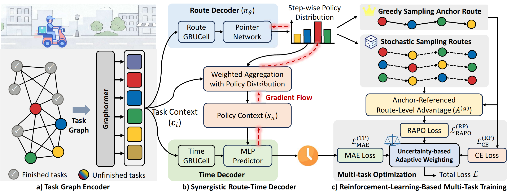
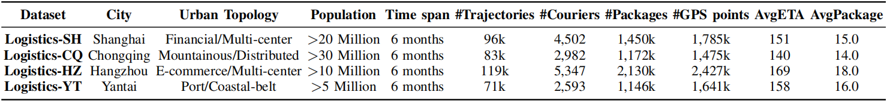

# SynRTP

The architecture of SynRTP, as shown in Figure 1, comprises three key components: 1) A **task graph encoder** that captures both spatial dependencies among tasks and their temporal evolution. 2) A **synergistic route-time decoder** where the route policy and time predictor are jointly optimized through gradient cooperation (addressing gradient isolation). 3) A **reinforcement-learning-based multi-task training strategy** combining RAPO for enhanced route exploration with uncertainty-based multi-task balancing.



<p align="center"><b>Figure&nbsp;1</b> Architecture of SynRTP.</p>


## 1. Experimental Details
---
### 1.1 Implementation Details & Fairness Protocol

To ensure reproducibility and a rigorous fair comparison, all experiments are conducted on a unified hardware platform with a single Tesla V100 GPU (16 GB). SynRTP is implemented in PyTorch. For all baseline models, we adopt a standardized evaluation protocol to avoid implementation bias:

#### (1) Standardized benchmark configurations

* **[`LaDe`](https://huggingface.co/datasets/Cainiao-AI/LaDe) benchmark baselines.** Most baselines (including DeepRoute, Graph2Route, etc.) and the datasets used in this paper are taken from the open-source LaDe benchmark repository. To make our results directly comparable with community standards, we strictly use the official implementations and their default optimal hyperparameter settings provided in LaDe.  
* **Independent baselines.** For baselines not included in LaDe (e.g., DutyTTE and MRGRP), we use their official open-source implementations and adopt the default optimal hyperparameter combinations recommended by the original authors. This strategy ensures that every baseline is evaluated close to its intended peak performance, avoiding bias from subjective re-tuning.

#### (2) Strict fairness control

Beyond model configurations, we enforce a unified training protocol across all methods so that no model receives an unfair advantage.  
- **Input consistency.** All models use exactly the same set of input features (spatial coordinates, temporal timestamps, and courier profiles). No baseline is handicapped by missing features, and no model has access to additional information unavailable to others.  
- **Termination criterion.** To prevent over-training or under-training biases, we apply a consistent early-stopping mechanism to all models: training stops if the validation metric (KRC) does not improve for 11 consecutive epochs.

#### (3) SynRTP settings

For SynRTP, hyperparameters are selected based on validation performance: the hidden dimension is set to $d_h = 32$, the Graphormer encoder has 3 layers with 4 attention heads, and the RAPO group sampling size is $G = 16$. We train the model in a two-stage scheme using the Adam optimizer with a learning rate of $1 \times 10^{-4}$.


### 1.2 Dataset Description

To rigorously evaluate our approach and ensure robust generalization, we conduct experiments on four large-scale, real-world logistics datasets: `Shanghai`, `Chongqing`, `Hangzhou`, and `Yantai`. Collected by Cainiao ([link](https://huggingface.co/datasets/Cainiao-AI/LaDe)), these datasets encompass highly diverse urban topologies, ranging from dense urban grids to complex mountainous road networks and coastal environments. Collectively, they provide a comprehensive and challenging benchmark for assessing routing performance across distinct spatial structures.

<p align="left"> <b>Table&nbsp;1</b> Summary statistics of the datasets. AvgETA (in minutes) stands for the average arrival time per package. AvgPackage means the average package number of a courier per day. </p>



#### (1) Privacy Statement

All datasets are strictly anonymized. User IDs and order IDs are hashed, and GPS coordinates are offset to prevent re-identification while preserving topological properties.

#### (2) Data Diversity

As shown in `Table 1`, these datasets cover a wide spectrum of city scales and urban environments.

**i) City Scale Diversity.**
To ensure the model generalizes across different administrative scales and population densities, we selected cities ranging from megacities to major regional hubs:

* **Mega-Cities (>20 Million):** Shanghai (SH) and Chongqing (CQ) represent the highest tier of urban density and complexity.
* **Large Metropolitan Area (10~20 Million):** Hangzhou (HZ) is a rapidly growing new-tier city with a population exceeding 10 million.
* **Major Regional Cities (5~10 Million):** As an important regional economic center, Yantai (YT) was selected to test the model’s adaptability to medium-to-large urban networks.

**ii) Urban Topology Diversity.**
The four cities also exhibit diverse urban forms and road-network topologies:

* **Shanghai (SH):** Flat megacity with a dense, grid-like road network and multiple commercial centers.
* **Chongqing (CQ):** Mountainous “multi-level” city with non-planar roads, steep gradients, and many bridges/tunnels.
* **Hangzhou (HZ):** Multi-center city combining e-commerce hubs with large scenic and preservation areas.
* **Yantai (YT):** Coastal port city with elongated, coastline-constrained urban belts.

These complementary topologies (grid-like vs. mountainous vs. coastal) jointly stress-test SynRTP under heterogeneous spatial constraints.


### 1.3 Data Generation for Model Training

Install environment dependencies using the following command:

```shell
pip install -r requirements.txt
```

After downloading the original datasets, please use the following command to generate the data required for model training:
```shell
bash DataPipeline.sh
```

To facilitate verification of the correctness of the model code, we provide a very small dataset of Logistics-YT, extracting a batch size of 8 from each of the original data training set, validation set and test set (the default batch size of the model dataset is 64).


### 1.4 Training SynRTP Model


Taking the Logistics-CQ dataset as an example. Run the following command to train the SynRTP. 

```shell
python run.py --dataset cq_dataset
```


### 1.5 Baseline Reproduction

Taking the Logistics-CQ dataset as an example. Use the following commands to reproduce baseline models:
```shell
# Time-Greedy
python baselines/RP/run.py --model Time-Greedy --dataset cq_dataset

# Distance-Greedy
python baselines/RP/run.py --model Distance-Greedy --dataset cq_dataset

# Osquare
python baselines/RP/run.py --model osqure --dataset cq_dataset

# DeepRoute
python baselines/RP/run.py --model deeproute --dataset cq_dataset

# Graph2Route
python baselines/RP/run.py --model graph2route --dataset cq_dataset

# DRL4Route
python baselines/RP/run.py --model drl4route --dataset cq_dataset

# Static-ETA
python baselines/TP/run.py --model speed --dataset cq_dataset

# MultiETA-KNN
python baselines/TP/run.py --model knn --dataset cq_dataset

# MultiETA-XGB
python baselines/TP/run.py --model lgb --dataset cq_dataset

# MultiDeepETA
python baselines/TP/run.py --model mlp --dataset cq_dataset

# DutyTTE
python baselines/TP/DutyTTE/main.py --dataset cq_dataset

# RankETPA
python baselines/RTP/RankETPA/run.py --model ranketpa_route --dataset cq_dataset

# M2G4RTP
python baselines/RTP/M2G4RTP/run.py  --dataset cq_dataset

# MRGRP
python baselines/RTP/MRGRP/run.py --dataset cq_dataset

```

